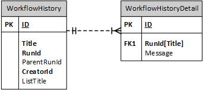
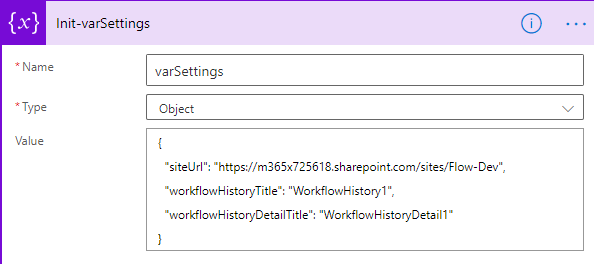

# SPFx-Samples

## Overview
This repo contains SPFx samples.

## WorkflowHistory-CreateList.zip
A Power Automate flow to provisioning workflow history lists

### Diagram

### Instructure
- Import WorkflowHistory-CreateList.zip to your Power Automate
- Open the flow and update the "Init-varSettings" action
  - siteUrl: the site collection which you want to create Workflow history lists
  - workflowHistoryTitle: the workflow history list title
  - workflowHistoryDetailTitle: the workflow history detail list title. 

## WorkflowHistory-Sample.zip
A Power Automate flow to demonstrate how to write log to workflow history lists

### Instructure
- Import WorkflowHistory-Sample.zip to your Power Automate

